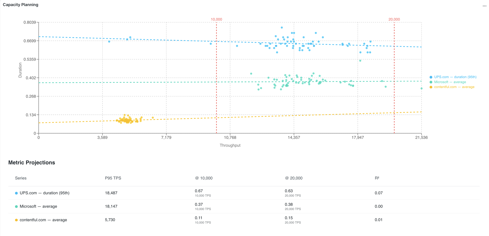

# Capacity Planning Visualisation

A New Relic One (NR1) custom visualisation for capacity planning. It correlates host metrics (CPU, memory, etc.) against service throughput across one or more named time-window samples, fits regression curves, and projects metric values at configurable throughput levels.

---

## How it works

1. You define one or more **samples** — named time windows (e.g. "Black Friday", "Normal Tuesday") each with a throughput NRQL query and a metrics NRQL query.
2. The visualisation fetches both queries as TIMESERIES data, inner-joins the results by timestamp, and plots each `(sample × metric)` pair as a scatter series.
3. A regression curve is fitted to each series. The **projection table** below the chart predicts metric values at configurable throughput multipliers and absolute targets.

---

## Screenshots



---

## Configuration reference

### Global options

| Field | Type | Default | Description |
|---|---|---|---|
| Bucket Size (seconds) | number | 60 | TIMESERIES granularity. Smaller values give more scatter points but increase query cost. |
| Target Throughput(s) | string | — | Comma-separated list of absolute throughput values (e.g. `5000,10000`). Each value is shown as a vertical reference line on the chart and as a column in the projection table. |
| X-Axis Multiplier | number | 1 | Extends the chart X-axis to `max observed throughput × multiplier` for visual trend extrapolation beyond the data. |
| Projection Multipliers | string | — | Comma-separated multipliers for projection table columns (e.g. `1,2,4,10`). Each column header shows the absolute TPS at that multiple of the baseline. |
| TPS Percentile | number | 95 | Percentile of observed throughput used as the baseline for multiplier calculations. Use `50` for median or `100` for max. |
| X-Axis Label | string | Throughput | Label shown on the scatter plot X-axis. |
| Y-Axis Label | string | Metric Value | Label shown on the scatter plot Y-axis. |
| Regression Type | enum | linear | Curve-fitting algorithm. Options: **linear** (`y = mx + b`), **polynomial** (quadratic), **power** (`y = ax^b`), **exponential** (`y = ae^bx`). Choose based on the shape of the scatter — linear is the safest default; power/exponential suit metrics that grow non-linearly with load. |

### Per-sample options

Each sample represents a distinct traffic period to compare. Multiple samples are overlaid on the same chart with different colours.

| Field | Type | Required | Description |
|---|---|---|---|
| Account ID | account-id | Yes | The New Relic account to query. Samples can target different accounts. |
| Sample Name | string | Yes | Display label (e.g. `Black Friday`). |
| Colour | string | No | Override the automatic palette. Accepts hex (`#E74C3C`) or any CSS colour. |
| Start Time | string | Yes | Window start. Accepts `YYYY-MM-DD` (midnight) or `YYYY-MM-DD HH:mm:ss`. |
| End Time | string | No | Window end. Same formats as Start Time. Defaults to 24 hours after start if omitted. |
| Throughput Query | nrql | Yes | NRQL returning a single numeric value per bucket. Do **not** include `TIMESERIES`, `SINCE`, or `UNTIL` — these are added automatically. |
| Metrics Query | nrql | Yes | NRQL returning one or more numeric columns per bucket. Supports `FACET` clauses — each facet value becomes a separate series. Do **not** include `TIMESERIES`, `SINCE`, or `UNTIL`. |

---

## NRQL query guidelines

Queries must be written **without** `TIMESERIES`, `SINCE`, or `UNTIL`. The visualisation appends these automatically based on the sample time window and bucket size.

**Throughput query** — should return a single `value` column (or any single numeric column):

```sql
SELECT rate(count(*), 1 SECOND) AS value FROM Transaction WHERE appName = 'checkout-service'
```

**Metrics query** — can return multiple columns; each becomes a separate series:

```sql
SELECT average(cpuPercent), average(memoryUsedPercent) FROM SystemSample WHERE hostname LIKE 'prod-web%'
```

**Metrics query with FACET** — each facet value produces its own series, allowing per-host or per-service breakdown:

```sql
SELECT average(cpuPercent) FROM SystemSample WHERE clusterName = 'prod' FACET hostname
```

---

## Regression type guide

| Type | Formula | When to use |
|---|---|---|
| Linear | `y = mx + b` | Metric scales proportionally with throughput. Safe default. |
| Polynomial | `y = ax² + bx + c` | Metric shows accelerating growth — useful for latency under saturation. Requires at least 3 points. |
| Power | `y = ax^b` | Metric follows a power law. Requires all x and y values to be positive. |
| Exponential | `y = ae^bx` | Metric grows explosively at high throughput. Requires all y values to be positive. |

The R² value in the projection table indicates goodness of fit (1.0 = perfect). If R² is low, try a different regression type or check for outliers in the data.

---

## Chart interaction

### Legend — multi-select highlighting

The legend on the right of the scatter plot lets you focus on one or more series at a time.

| Action | Effect |
|---|---|
| **Click** a series | Adds it to the highlighted set; all other series are dimmed. Click again to deselect. |
| **Alt-click** a series | Removes it from the highlighted set (useful when you want to deselect without accidentally re-selecting). |
| All deselected | All series return to normal opacity. |

You can highlight any number of series simultaneously. Series and their matching regression trend lines are highlighted or dimmed together.

### Zoom

Click and drag horizontally on the chart to zoom into a region of the X axis. Click **Reset zoom** to return to the full range.

---

## Limitations

- Sample windows are capped at **24 hours**. Windows requiring more than 366 TIMESERIES buckets are automatically split into sub-window batches.
- `FACET` in the **throughput query** and **metrics query** must produce matching facet values — unmatched facets are discarded with a warning.
- Power and exponential regression silently drop data points where `x ≤ 0` or `y ≤ 0`.

---

## Running locally

```bash
npm install
nr1 nerdpack:serve
```

Open New Relic One, go to **Apps > Custom Visualizations > Capacity Planning**, and add the visualisation to a dashboard.

## Installation

```bash
nr1 nerdpack:publish
nr1 subscription:set
```


